# Neural Coding Assistant - Signal Flow Architecture

```mermaid
graph TD
    %% External Interfaces
    User[👤 User/Developer] --> API[🌐 REST API<br/>FastAPI Server<br/>:8000]
    IDE[🛠️ VS Code<br/>Continue Extension] --> API
    CLI[💻 Command Line<br/>Interface] --> API
    
    %% API Layer
    API --> Health[❤️ /health]
    API --> Models[📋 /models]
    API --> Chat[💬 /v1/chat/completions]
    
    %% Main Processing Flow
    Chat --> ErrorHandler{🛡️ Error Handler<br/>- Validation<br/>- Timeout<br/>- Retry Logic}
    ErrorHandler --> Dispatcher[🎯 Admin Dispatcher<br/>admin_dispatcher.py]
    
    %% Administrative Mesh Processing
    Dispatcher --> TaskParser[📝 Task Parser<br/>Enhanced Classification]
    TaskParser --> Config[⚙️ Config System<br/>config.py]
    Config --> Keywords{🔍 Keyword Analysis<br/>- debug: error, bug<br/>- analyze: review, inspect<br/>- fix: repair, solve<br/>- clean: optimize<br/>- refactor: restructure}
    
    TaskParser --> CouncilRouter[🏛️ Council Router<br/>Model Selection]
    CouncilRouter --> AdminModel[🤖 Selected Admin Model]
    
    Dispatcher --> AttentionRouter[🎯 Attention Router<br/>Context Retrieval]
    AttentionRouter --> AgentMemory[(🧠 Agent Memory<br/>JSON Files)]
    
    Dispatcher --> MemoryExpander[📈 Memory Expander<br/>Context Compression]
    
    Dispatcher --> FunctionCourier[📋 Function Courier<br/>Signature Parser]
    FunctionCourier --> Config
    FunctionCourier --> CourierMD[📄 Function_Courier.md<br/>Fallback Signatures]
    
    %% Payload Assembly
    Dispatcher --> PayloadAssembly[📦 Payload Assembly<br/>- code_str<br/>- error_msg<br/>- context<br/>- function_sig]
    
    %% LLM Mesh Processing
    PayloadAssembly --> MeshManager[🕸️ Mesh Manager<br/>mesh_manager.py]
    
    MeshManager --> TaskRouter{🔀 Task Router<br/>Route by Type}
    
    %% Worker Handlers
    TaskRouter -->|debug| DebugHandler[🐛 Debug Handler<br/>_handle_debug_task]
    TaskRouter -->|analyze| AnalyzeHandler[🔍 Analyze Handler<br/>_handle_analyze_task]
    TaskRouter -->|fix| FixHandler[🔧 Fix Handler<br/>_handle_fix_task]
    TaskRouter -->|clean| CleanHandler[🧹 Clean Handler<br/>_handle_clean_task]
    TaskRouter -->|refactor| RefactorHandler[🔄 Refactor Handler<br/>_handle_refactor_task]
    
    %% Worker Implementation Layers
    DebugHandler --> WolframDebug[🧮 Wolfram Worker<br/>Subprocess Call]
    AnalyzeHandler --> WolframAnalyze[🧮 Wolfram Worker<br/>Subprocess Call]
    FixHandler --> PytorchFix[🔥 PyTorch Model<br/>In-Process]
    CleanHandler --> WolframClean[🧮 Wolfram Worker<br/>Subprocess Call]
    RefactorHandler --> LocalRefactor[🏠 Local Handler<br/>Fallback Logic]
    
    %% Fallback System
    WolframDebug --> FallbackCheck{❓ Wolfram Available?}
    WolframAnalyze --> FallbackCheck
    WolframClean --> FallbackCheck
    
    FallbackCheck -->|No| MockDebug[🔄 Fallback Debug<br/>Mock Response]
    FallbackCheck -->|No| MockAnalyze[🔄 Fallback Analyze<br/>Mock Response]
    FallbackCheck -->|No| MockClean[🔄 Fallback Clean<br/>Mock Response]
    
    FallbackCheck -->|Yes| WolframExec[⚡ Wolfram Execution<br/>asyncio subprocess]
    
    %% PyTorch Path
    PytorchFix --> ModelCheck{🤖 Model Available?}
    ModelCheck -->|No| MockFix[🔄 Fallback Fix<br/>Mock Response]
    ModelCheck -->|Yes| LlamaModel[🦙 llama-cpp-python<br/>GGUF Models]
    
    %% Results Aggregation
    WolframExec --> ResultAgg[📊 Result Aggregation]
    MockDebug --> ResultAgg
    MockAnalyze --> ResultAgg
    MockFix --> ResultAgg
    MockClean --> ResultAgg
    LocalRefactor --> ResultAgg
    LlamaModel --> ResultAgg
    
    %% Response Processing
    ResultAgg --> TaskLifecycle[📝 Task Lifecycle<br/>Event Logging]
    TaskLifecycle --> LogFiles[(📄 JSON Logs)]
    
    ResultAgg --> ResponseFormat[📤 Response Formatter<br/>OpenAI Compatible]
    ResponseFormat --> StreamCheck{🌊 Stream Response?}
    
    StreamCheck -->|Yes| StreamResponse[📡 Streaming Response<br/>Server-Sent Events]
    StreamCheck -->|No| JSONResponse[📋 JSON Response<br/>Standard Format]
    
    StreamResponse --> User
    JSONResponse --> User
    
    %% Error Flow
    ErrorHandler -->|Timeout| TimeoutResponse[⏰ Timeout Error<br/>30s Default]
    ErrorHandler -->|Retry Failed| RetryFailure[🔄 Retry Exhausted<br/>Exponential Backoff]
    ErrorHandler -->|Circuit Open| CircuitBreakerResponse[⚡ Circuit Breaker<br/>Service Unavailable]
    
    TimeoutResponse --> User
    RetryFailure --> User
    CircuitBreakerResponse --> User
    
    %% Configuration Flow
    Config --> TaskKeywords[🏷️ Task Keywords<br/>Classification Rules]
    Config --> FunctionSigs[📝 Function Signatures<br/>Worker Contracts]
    Config --> EndpointMap[🗺️ Endpoint Mapping<br/>Service URLs]
    
    %% Model Management
    MeshManager --> ModelInit[🚀 Model Initialization<br/>Dependency Checking]
    ModelInit --> CheckLlama{🦙 llama-cpp-python?}
    ModelInit --> CheckWolfram{🧮 Wolfram Engine?}
    
    CheckLlama -->|Yes| LlamaReady[✅ GGUF Ready]
    CheckLlama -->|No| LlamaFallback[⚠️ Fallback Mode]
    
    CheckWolfram -->|Yes| WolframReady[✅ Wolfram Ready]
    CheckWolfram -->|No| WolframFallback[⚠️ Mock Responses]
    
    %% Microservice Architecture (Optional)
    MeshManager -.->|HTTP Mode| DebugEndpoint[🌐 Debug Service<br/>:8001/debug]
    MeshManager -.->|HTTP Mode| AnalyzeEndpoint[🌐 Analyze Service<br/>:8002/analyze]
    MeshManager -.->|HTTP Mode| FixEndpoint[🌐 Fix Service<br/>:8003/fix]
    MeshManager -.->|HTTP Mode| CleanEndpoint[🌐 Clean Service<br/>:8004/clean]
    
    %% External Dependencies
    WolframExec -.-> WolframEngine[🧮 Wolfram Engine<br/>External Process]
    LlamaModel -.-> GGUFFiles[📁 GGUF Model Files<br/>Local Storage]
    AgentMemory -.-> ContextFiles[📁 Context JSONs<br/>File System]
    
    %% Styling
    classDef userInterface fill:#e1f5fe,stroke:#01579b,stroke-width:2px
    classDef apiLayer fill:#f3e5f5,stroke:#4a148c,stroke-width:2px
    classDef adminMesh fill:#e8f5e8,stroke:#2e7d32,stroke-width:2px
    classDef llmMesh fill:#fff3e0,stroke:#ef6c00,stroke-width:2px
    classDef workers fill:#fce4ec,stroke:#880e4f,stroke-width:2px
    classDef fallback fill:#fff8e1,stroke:#f57f17,stroke-width:2px
    classDef config fill:#f1f8e9,stroke:#558b2f,stroke-width:2px
    classDef external fill:#fafafa,stroke:#424242,stroke-width:2px
    
    class User,IDE,CLI userInterface
    class API,Health,Models,Chat apiLayer
    class Dispatcher,TaskParser,CouncilRouter,AttentionRouter,MemoryExpander,FunctionCourier,PayloadAssembly adminMesh
    class MeshManager,TaskRouter,ResultAgg,ResponseFormat llmMesh
    class DebugHandler,AnalyzeHandler,FixHandler,CleanHandler,RefactorHandler workers
    class MockDebug,MockAnalyze,MockFix,MockClean,FallbackCheck fallback
    class Config,TaskKeywords,FunctionSigs,EndpointMap config
    class WolframEngine,GGUFFiles,ContextFiles,LogFiles external
```

## Signal Flow Description

### 1. **Entry Points** 
- User interactions via REST API, VS Code Continue extension, or CLI
- All requests flow through FastAPI server on port 8000

### 2. **API Layer Processing**
- Request validation and error handling
- Health checks and model listing endpoints
- Main chat completions endpoint with retry logic

### 3. **Administrative Mesh** 
- **Task Classification**: Enhanced keyword-based parsing
- **Model Selection**: Council router chooses appropriate admin
- **Context Retrieval**: Attention router gets relevant memory
- **Signature Loading**: Function courier ensures contract compliance
- **Payload Assembly**: All data packaged for execution

### 4. **LLM Mesh Routing**
- Task router directs to appropriate worker handler
- Each task type has dedicated handler with fallback logic
- Supports both in-process and microservice deployment

### 5. **Worker Execution**
- **Debug/Analyze/Clean**: Wolfram Language workers (with fallbacks)
- **Fix**: PyTorch/GGUF models (with fallbacks) 
- **Refactor**: Local processing
- All workers have mock implementations for reliability

### 6. **Response Processing**
- Results aggregated and formatted
- OpenAI-compatible response structure
- Support for both streaming and standard responses
- Comprehensive error handling and logging

### 7. **Configuration System**
- Centralized keyword mappings and function signatures
- Easy extensibility for new task types
- Single source of truth for system behavior

### 8. **Fallback Strategy**
- Graceful degradation when external tools unavailable
- Circuit breaker prevents cascade failures
- Meaningful responses even in minimal environments

This architecture provides **robust, scalable, and maintainable** AI coding assistance with professional-grade reliability and clear upgrade paths for enhanced functionality.
